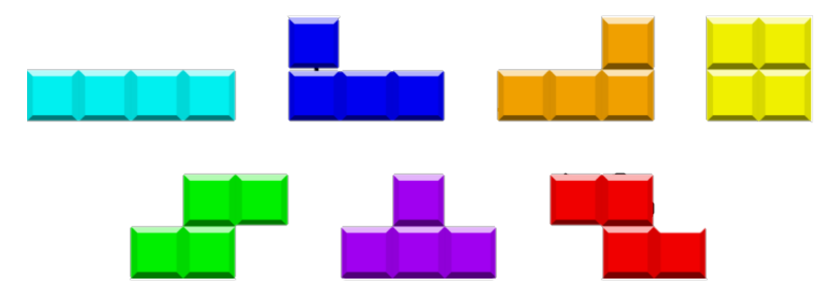

Instructions
Setup: Create a new Java project and either import or copy/paste 
the contents of BrokenTetris.java into a new Java project. 
Remember to save after completing each problem.

Bug Fixes
1. Fix the compiler errors
2. Get Tetris to run
Minor Enhancements
1. Change the piece colors as displayed below. Cyan, blue, orange, yellow, green, pink, red.

\
2. Add the ability to rotate the piece counterclockwise when pressing the “UP” arrow key 
on the keyboard (Note: Pieces will not maintain their normal shape until later).